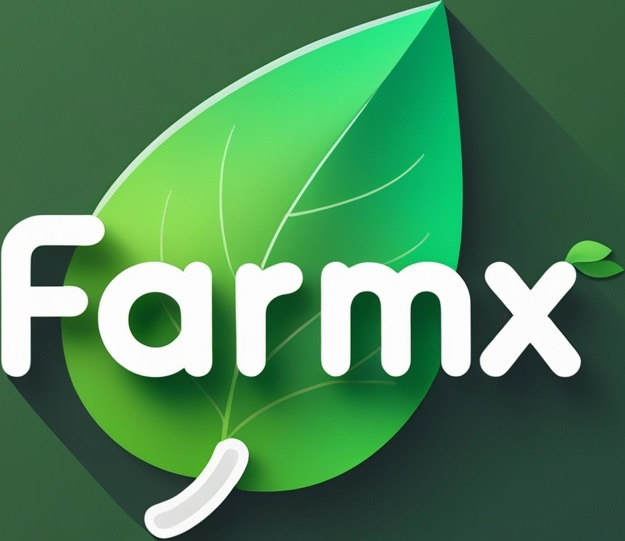

# Agri-Social & Marketplace Platform

<p align="center">
  
</p>

## 📖 Description

**FarmX** is a comprehensive web platform designed for the agricultural community. It seamlessly integrates social networking features with a dedicated marketplace, a real-time messaging system, and an intelligent AI chatbot. The platform aims to connect farmers, provide them with a space to share knowledge, and facilitate the buying and selling of agricultural products.

## ✨ Features

- **👤 User Authentication:** Secure sign-up, login, and logout functionality.
- **🖼️ User Profiles:** Customizable user profiles with profile pictures, bios, and user-specific content.
- **📰 Social Feed:** Create posts with text and media, view a timeline of posts from other users, and interact by liking and commenting.
- **🛒 Marketplace:** A dedicated section to list, browse, edit, and delete agricultural products. Includes product details, images, and pricing.
- **💬 Real-time Messaging:** A private messaging system for users to communicate directly.
- **🤖 AI Chatbot:** An integrated chatbot powered by OpenAI's GPT models to answer farming-related questions on topics like crops, irrigation, and best practices.
- **🔔 Notifications:** A system to notify users of new likes, comments, and other important activities.
- **📷 Media Uploads:** Users can upload images and videos for their posts and marketplace listings.

## 🛠️ Technologies Used

- **Backend:** PHP, Python (for the Flask-based chatbot API)
- **Frontend:** HTML, CSS, JavaScript, jQuery
- **Database:** MySQL
- **AI Integration:** OpenAI API
- **Web Server:** Designed to run on a stack like LAMP, WAMP, or MAMP (e.g., Laragon).

## 🚀 Getting Started

Follow these instructions to get a copy of the project up and running on your local machine.

### Prerequisites

- A web server environment (e.g., [Laragon](https://laragon.org/), XAMPP, WAMP)
- [PHP](https://www.php.net/) 7.4 or higher
- [MySQL](https://www.mysql.com/)
- [Python](https://www.python.org/) 3.6 or higher & `pip`
- [Git](https://git-scm.com/)

### Installation

1.  **Clone the repository:**
    ```sh
    git clone <your-repository-url>
    cd PFE
    ```

2.  **Database Setup:**
    -   Start your MySQL service.
    -   Create a new database (e.g., `pfe_db`).
    -   Import the database schema using the `main.sql` file:
        ```sh
        mysql -u your_username -p your_database_name < main.sql
        ```

3.  **Configure the Application:**
    -   Open `config.php` and `database/db_connect.php`.
    -   Update the database credentials (`$servername`, `$username`, `$password`, `$dbname`) to match your local setup.

4.  **Setup the Chatbot:**
    -   Navigate to the project root in your terminal.
    -   Install the required Python packages:
        ```sh
        pip install -r requirements.txt
        ```
    -   Create a `.env` file in the root directory.
    -   Add your OpenAI API key to the `.env` file:
        ```
        OPENAI_API_KEY="your_openai_api_key_here"
        ```
    -   Run the chatbot's Flask API server:
        ```sh
        python chatbot_api.py
        ```
        The API will be available at `http://127.0.0.1:5000`.

5.  **Run the Main Application:**
    -   Place the project folder in your web server's root directory (e.g., `C:/laragon/www/PFE`).
    -   Start your web server.
    -   Access the project in your browser (e.g., `http://pfe.test` or `http://localhost/PFE`).

## 📁 Project Structure

Here is an overview of the key files and directories:

```
PFE/
├── database/
│   └── db_connect.php       # Database connection script
├── Images/                  # Static images and logo
├── uploads/                 # User-uploaded content (posts, products, profiles)
├── add_product.php          # Logic for adding marketplace products
├── chatbot.php              # Frontend for the AI chatbot
├── chatbot_api.py           # Backend API for the chatbot (Flask)
├── config.php               # Main configuration file
├── index.php                # Login/Landing page
├── main.php                 # Main social feed page
├── market.php               # Marketplace browsing page
├── message.php              # Messaging interface
├── profile.php              # User profile page
├── signup.php               # User registration page
├── main.sql                 # Database schema
├── README.md                # This file
└── requirements.txt         # Python dependencies
```

## 🖼️ Screenshots

Here are some screenshots showcasing the platform's features.

### Authentification
*Login and registration pages.*


### Main Feed
*The central social hub for user posts.*


### Marketplace
*Browse and list agricultural products.*


### Profile
*User profiles with their posts and information.*


### Real-time Messaging
*Private conversations between users.*


### Notifications
*Stay updated on platform activities.*


### AI Chatbot
*Get instant answers to agricultural questions.*


##
<p align="center">
  ---
</p>
<p align="center">
  <em>Developed with ❤️ for the agricultural community.</em>
</p>